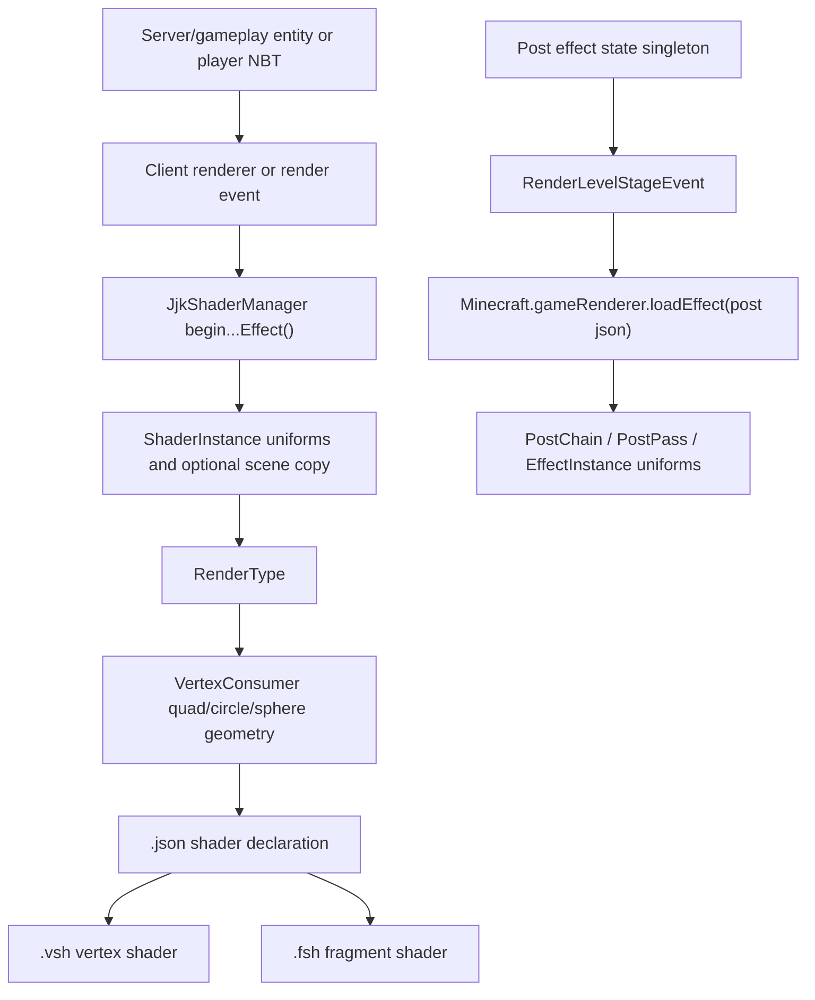

# JJK Strongest Rendering And Shader System Reference

Workspace used for this audit:

`E:\minecraft mods\jujutsu kaisen 1.21.1`

This document explains how the mod renders custom entity effects, world-space quads, first-person shader overlays, and full-screen post-processing shaders. It is written as a handoff reference for reusing the same architecture in another NeoForge 1.21.1 project.

## High-Level Architecture

The rendering system has four major layers:



There are two different shader systems in play:

1. Core shader render types: used by entity renderers and hand/GUI renderers. These draw geometry directly through `VertexConsumer`.
2. Post-processing shaders: loaded through `Minecraft.gameRenderer.loadEffect(...)` and applied to the whole screen.

## Core Files

| Role | File |
|---|---|
| Custom shader registration and uniform helpers | `E:\minecraft mods\jujutsu kaisen 1.21.1\src\main\java\net\efkrdnz\jjkstrongest\client\JjkShaderManager.java` |
| Entity renderer registration | `E:\minecraft mods\jujutsu kaisen 1.21.1\src\main\java\net\efkrdnz\jjkstrongest\init\JjkStrongestModEntityRenderers.java` |
| First-person render hook | `E:\minecraft mods\jujutsu kaisen 1.21.1\src\main\java\net\efkrdnz\jjkstrongest\client
enderer\RedFirstPersonRenderHook.java` |
| Dismantle slash renderer | `E:\minecraft mods\jujutsu kaisen 1.21.1\src\main\java\net\efkrdnz\jjkstrongest\client\renderer\DismantleProjectileRenderer.java` |
| Dismantle travel renderer | `E:\minecraft mods\jujutsu kaisen 1.21.1\src\main\java\net\efkrdnz\jjkstrongest\client\renderer\DismantleTravelRenderer.java` |
| Hollow Purple renderer | `E:\minecraft mods\jujutsu kaisen 1.21.1\src\main\java\net\efkrdnz\jjkstrongest\client\renderer\HollowPurpleBigRenderer.java` |
| Hollow Nuke renderer | `E:\minecraft mods\jujutsu kaisen 1.21.1\src\main\java\net\efkrdnz\jjkstrongest\client\renderer\HollowNukeRenderer.java` |
| Unlimited Void entity renderer | `E:\minecraft mods\jujutsu kaisen 1.21.1\src\main\java\net\efkrdnz\jjkstrongest\client\renderer\DomainUVRenderer.java` |
| Flame Arrow explosion renderer | `E:\minecraft mods\jujutsu kaisen 1.21.1\src\main\java\net\efkrdnz\jjkstrongest\client\renderer\FlameArrowExplosionRenderer.java` |
| Fuga domain explosion renderer | `E:\minecraft mods\jujutsu kaisen 1.21.1\src\main\java\net\efkrdnz\jjkstrongest\client\renderer\FugaDomainExplosionRenderer.java` |
| Black Flash lightning world renderer | `E:\minecraft mods\jujutsu kaisen 1.21.1\src\main\java\net\efkrdnz\jjkstrongest\client
enderer\BlackFlashLightningClientRenderer.java` |
| Unlimited Void line world renderer | `E:\minecraft mods\jujutsu kaisen 1.21.1\src\main\java\net\efkrdnz\jjkstrongest\client
enderer\DomainUVLinesClientRenderer.java` |
| Information Overload overlay renderer | `E:\minecraft mods\jujutsu kaisen 1.21.1\src\main\java\net\efkrdnz\jjkstrongest\InformationOverloadDebugLinesClientRenderer.java` |
| Cleave post shader loader | `E:\minecraft mods\jujutsu kaisen 1.21.1\src\main\java\net\efkrdnz\jjkstrongest\procedures\CleaveDistortionShaderProcedure.java` |
| Impact frame post shader loader | `E:\minecraft mods\jujutsu kaisen 1.21.1\src\main\java\net\efkrdnz\jjkstrongest\procedures\ImpactFrameShaderProcedure.java` |
| Black Flash post shader loader | `E:\minecraft mods\jujutsu kaisen 1.21.1\src\main\java\net\efkrdnz\jjkstrongest\procedures\BlackFlashShaderProcedure.java` |

Note: on 1.20.1 several of these files sat in the package root while declaring a
subpackage. The port moved each one into the directory matching its declared package.

## Shader Manager Pattern

`JjkShaderManager` is the central bridge between Java and the shader asset files.

It stores one `ShaderInstance` and one `RenderType` per custom shader:

```java
public static ShaderInstance DISMANTLE_SHADER;
public static RenderType DISMANTLE_RENDER_TYPE;

public static ShaderInstance HOLLOW_PURPLE_SHADER;
public static RenderType HOLLOW_PURPLE_RENDER_TYPE;

public static ShaderInstance BLUE_ORB_SHADER;
public static RenderType BLUE_ORB_RENDER_TYPE;
```

It listens to `RegisterShadersEvent`, loads a shader by `ResourceLocation`, then creates a matching `RenderType`:

```java
event.registerShader(
    new ShaderInstance(
        event.getResourceProvider(),
        ResourceLocation.fromNamespaceAndPath("jjk_strongest", "dismantle_slash"),
        DefaultVertexFormat.POSITION_TEX
    ),
    shader -> {
        DISMANTLE_SHADER = shader;
        DISMANTLE_RENDER_TYPE = makeRenderType("dismantle_slash", () -> DISMANTLE_SHADER);
    }
);
```

The `ResourceLocation("jjk_strongest", "dismantle_slash")` maps to this shader JSON:

`E:\minecraft mods\jujutsu kaisen 1.21.1\src\main\resources\assets\jjk_strongest\shaders\core\dismantle_slash.json`

The JSON then names the actual vertex and fragment shaders:

```json
{
  "vertex": "jjk_strongest:dismantle_slash",
  "fragment": "jjk_strongest:dismantle_slash",
  "attributes": ["Position", "UV0"],
  "samplers": [
    { "name": "SceneSampler" }
  ],
  "uniforms": [
    { "name": "ModelViewMat", "type": "matrix4x4", "count": 16, "values": [1,0,0,0, 0,1,0,0, 0,0,1,0, 0,0,0,1] },
    { "name": "ProjMat", "type": "matrix4x4", "count": 16, "values": [1,0,0,0, 0,1,0,0, 0,0,1,0, 0,0,0,1] },
    { "name": "OutSize", "type": "float", "count": 2, "values": [1, 1] },
    { "name": "Time", "type": "float", "count": 1, "values": [0.0] },
    { "name": "SlashLength", "type": "float", "count": 1, "values": [8.0] },
    { "name": "SlashWidth", "type": "float", "count": 1, "values": [0.35] }
  ]
}
```

### RenderType Creation

The normal transparent render type:

```java
private static RenderType makeRenderType(String name, Supplier<ShaderInstance> shaderSup) {
    return RenderType.create(
        name,
        DefaultVertexFormat.POSITION_TEX,
        VertexFormat.Mode.QUADS,
        256,
        false,
        true,
        RenderType.CompositeState.builder()
            .setShaderState(new RenderStateShard.ShaderStateShard(shaderSup))
            .setDepthTestState(new RenderStateShard.DepthTestStateShard("lequal", 515))
            .setCullState(new RenderStateShard.CullStateShard(false))
            .setWriteMaskState(new RenderStateShard.WriteMaskStateShard(true, false))
            .setTransparencyState(new RenderStateShard.TransparencyStateShard(
                "translucent_transparency",
                () -> {
                    RenderSystem.enableBlend();
                    RenderSystem.blendFuncSeparate(
                        GL11.GL_SRC_ALPHA,
                        GL11.GL_ONE_MINUS_SRC_ALPHA,
                        GL11.GL_ONE,
                        GL11.GL_ONE_MINUS_SRC_ALPHA
                    );
                },
                () -> {
                    RenderSystem.disableBlend();
                    RenderSystem.defaultBlendFunc();
                }
            ))
            .createCompositeState(true)
    );
}
```

The additive glow render type:

```java
private static RenderType makeAdditiveRenderType(String name, Supplier<ShaderInstance> shaderSup) {
    return RenderType.create(
        name,
        DefaultVertexFormat.POSITION_TEX,
        VertexFormat.Mode.QUADS,
        256,
        false,
        true,
        RenderType.CompositeState.builder()
            .setShaderState(new RenderStateShard.ShaderStateShard(shaderSup))
            .setCullState(new RenderStateShard.CullStateShard(false))
            .setWriteMaskState(new RenderStateShard.WriteMaskStateShard(true, false))
            .setTransparencyState(new RenderStateShard.TransparencyStateShard(
                "additive",
                () -> {
                    RenderSystem.enableBlend();
                    RenderSystem.blendFuncSeparate(
                        GL11.GL_SRC_ALPHA,
                        GL11.GL_ONE,
                        GL11.GL_ONE,
                        GL11.GL_ONE
                    );
                },
                () -> {
                    RenderSystem.disableBlend();
                    RenderSystem.defaultBlendFunc();
                }
            ))
            .createCompositeState(true)
    );
}
```

Use normal transparency when the effect should blend into the scene. Use additive blending for fire, energy, lightning, beams, and glow.

## Scene-Copy Shaders

Some effects need to sample the already-rendered scene, distort it, and draw the result on a quad. `Dismantle`, `Hollow Purple`, `Purple Charge`, and `Hollow Nuke` use this idea.

The core logic is:

```java
RenderTarget main = mc.getMainRenderTarget();
ensureSceneCopy(w, h);
copyMainToSceneCopy(main, SCENE_COPY, w, h);
DISMANTLE_SHADER.setSampler("SceneSampler", SCENE_COPY.getColorTextureId());
setUniformIfExistsDismantle("OutSize", (float) w, (float) h);
setUniformIfExistsDismantle("Time", timeSeconds);
```

The framebuffer copy is a raw OpenGL blit:

```java
GL30.glBindFramebuffer(GL30.GL_READ_FRAMEBUFFER, from.frameBufferId);
GL30.glBindFramebuffer(GL30.GL_DRAW_FRAMEBUFFER, to.frameBufferId);
GL30.glBlitFramebuffer(
    0, 0, w, h,
    0, 0, w, h,
    GL11.GL_COLOR_BUFFER_BIT,
    GL11.GL_NEAREST
);
from.bindWrite(true);
```

This lets the fragment shader do:

```glsl
uniform sampler2D SceneSampler;
uniform vec2 OutSize;

vec2 suv = gl_FragCoord.xy / OutSize;
vec3 scene = texture(SceneSampler, suv).rgb;
```

That is the important difference between a plain glowing sprite and a distortion/refraction effect.

## Entity Renderer Pattern: Dismantle Slash

Representative file:

`E:\minecraft mods\jujutsu kaisen 1.21.1\src\main\java\net\efkrdnz\jjkstrongest\client\renderer\DismantleProjectileRenderer.java`

The renderer:

1. Checks that the render type exists.
2. Sends entity-specific uniforms through `JjkShaderManager.beginFrameCaptureDismantle(...)`.
3. Orients the quad based on the slash direction.
4. Scales the quad by slash length and width.
5. Writes four vertices.
6. Flushes the custom render type batch.

Condensed version:

```java
if (JjkShaderManager.DISMANTLE_RENDER_TYPE == null) return;

float timeSeconds = (entity.tickCount + partialTick) / 20.0f;
if (!JjkShaderManager.beginFrameCaptureDismantle(
        timeSeconds,
        entity.getSlashStyle(),
        entity.getSlashSeed(),
        entity.getSlashLength(),
        entity.getSlashWidth(),
        entity.getColorR(),
        entity.getColorG(),
        entity.getColorB())) {
    return;
}

poseStack.pushPose();
poseStack.translate(0.0, entity.getBbHeight() * 0.5, 0.0);

float dx = entity.getDirX();
float dy = entity.getDirY();
float dz = entity.getDirZ();

float yaw = (float) Mth.atan2((double) dx, (double) dz);
float horiz = Mth.sqrt(dx * dx + dz * dz);
float pitch = (float) (-Mth.atan2((double) dy, (double) horiz));

poseStack.mulPose(Axis.YP.rotation(yaw));
poseStack.mulPose(Axis.XP.rotation(pitch));
poseStack.mulPose(Axis.ZP.rotation(entity.getSlashRoll()));

poseStack.scale(entity.getSlashLength(), entity.getSlashWidth(), 1.0f);

VertexConsumer vc = bufferSource.getBuffer(JjkShaderManager.DISMANTLE_RENDER_TYPE);
Matrix4f m = poseStack.last().pose();

vc.addVertex(m, -0.5f, -0.5f, 0.0f).setUv(0.0f, 1.0f);
vc.addVertex(m,  0.5f, -0.5f, 0.0f).setUv(1.0f, 1.0f);
vc.addVertex(m,  0.5f,  0.5f, 0.0f).setUv(1.0f, 0.0f);
vc.addVertex(m, -0.5f,  0.5f, 0.0f).setUv(0.0f, 0.0f);

poseStack.popPose();

if (bufferSource instanceof MultiBufferSource.BufferSource bs) {
    bs.endBatch(JjkShaderManager.DISMANTLE_RENDER_TYPE);
}
```

The travel slash renderer is the same pattern without the short-lived expand/fade animation:

`E:\minecraft mods\jujutsu kaisen 1.21.1\src\main\java\net\efkrdnz\jjkstrongest\client\renderer\DismantleTravelRenderer.java`

## Circular Shader Quad Pattern

Hollow Purple, Imaginary Purple, and Hollow Nuke render a camera-facing circular mesh. They are not real sphere meshes; they are many small triangles drawn in a circle on a billboard plane.

Representative file:

`E:\minecraft mods\jujutsu kaisen 1.21.1\src\main\java\net\efkrdnz\jjkstrongest\client\renderer\HollowPurpleBigRenderer.java`

Key code:

```java
poseStack.translate(0.0, entity.getBbHeight() * 0.5, 0.0);
poseStack.mulPose(Axis.YP.rotationDegrees(-entityRenderDispatcher.camera.getYRot()));
poseStack.mulPose(Axis.XP.rotationDegrees(entityRenderDispatcher.camera.getXRot()));
poseStack.scale(size, size, size);

VertexConsumer vc = bufferSource.getBuffer(JjkShaderManager.HOLLOW_PURPLE_RENDER_TYPE);
Matrix4f m = poseStack.last().pose();

int segments = 64;
float angleStep = (float) (2 * Math.PI / segments);
for (int i = 0; i < segments; i++) {
    float angle1 = i * angleStep;
    float angle2 = (i + 1) * angleStep;

    float x1 = (float) Math.cos(angle1) * 0.5f;
    float y1 = (float) Math.sin(angle1) * 0.5f;
    float x2 = (float) Math.cos(angle2) * 0.5f;
    float y2 = (float) Math.sin(angle2) * 0.5f;

    vc.addVertex(m, 0, 0, 0).setUv(0.5f, 0.5f);
    vc.addVertex(m, x1, y1, 0).setUv(x1 + 0.5f, y1 + 0.5f);
    vc.addVertex(m, x2, y2, 0).setUv(x2 + 0.5f, y2 + 0.5f);
    vc.addVertex(m, 0, 0, 0).setUv(0.5f, 0.5f);
}
```

Used by:

| Renderer | Shader render type |
|---|---|
| `HollowPurpleBigRenderer` | `HOLLOW_PURPLE_RENDER_TYPE` |
| `HollowNukeRenderer` | `HOLLOW_NUKE_RENDER_TYPE` |
| `ImaginaryPurpleRenderer` | `IMAGINARY_PURPLE_PROJECTILE_RENDER_TYPE` |
| `DomainUVRenderer` | `VOID_BLACKHOLE_RENDER_TYPE`, `VOID_RIFT_RENDER_TYPE` |

## Inverted Sphere Pattern: Unlimited Void

`DomainUVRenderer` draws multiple layers once the domain reaches `tickCount >= 80`:

```java
if (entity.tickCount >= 80) {
    renderWhiteBrushes(entity, partialTick, poseStack, bufferSource);
    renderRift(entity, partialTick, poseStack, bufferSource);
    renderBlackHole(entity, partialTick, poseStack, bufferSource);
}
```

The white brush pass renders an inside-facing sphere made of quad strips:

```java
for (int lat = 0; lat < latSegments; lat++) {
    float theta1 = (lat / (float) latSegments) * (float) Math.PI;
    float theta2 = ((lat + 1) / (float) latSegments) * (float) Math.PI;

    for (int lon = 0; lon < lonSegments; lon++) {
        float phi1 = (lon / (float) lonSegments) * 2.0f * (float) Math.PI;
        float phi2 = ((lon + 1) / (float) lonSegments) * 2.0f * (float) Math.PI;

        // Four sphere points -> one quad.
        vc.addVertex(matrix, x1, y1, z1).setUv(u1, v1);
        vc.addVertex(matrix, x4, y4, z4).setUv(u1, v2);
        vc.addVertex(matrix, x3, y3, z3).setUv(u2, v2);
        vc.addVertex(matrix, x2, y2, z2).setUv(u2, v1);
    }
}
```

This is a cheap way to make a dome/void interior without a model file.

## Fuga / Flame Explosion Pattern

`FugaDomainExplosionRenderer` renders two quads:

1. A giant ground disc.
2. A vertical camera-facing billboard.

```java
// Ground disc
poseStack.translate(0, 0.05f, 0);
poseStack.mulPose(Axis.XP.rotationDegrees(90f));
poseStack.scale(radius, radius, radius);
drawQuad(poseStack, vc, light);

// Vertical billboard
Vec3 cam = Minecraft.getInstance().gameRenderer.getMainCamera().getPosition();
Vec3 toCam = cam.subtract(entity.position()).normalize();
float yaw = (float) Math.toDegrees(Math.atan2(toCam.x, toCam.z));
float pitch = (float) Math.toDegrees(Math.asin(-toCam.y));

poseStack.translate(0, 18f, 0);
poseStack.mulPose(Axis.YP.rotationDegrees(yaw));
poseStack.mulPose(Axis.XP.rotationDegrees(pitch));
poseStack.scale(radius, radius, radius);
drawQuad(poseStack, vc, light);
```

`FlameArrowExplosionRenderer` expands this into phases:

| Phase | Tick range | Render method |
|---|---:|---|
| Persistent core | `< 28` | `renderGroundCore` |
| Flash warning | `0-3` | `renderFlashCore` |
| Fire pillar | `3-25` | `renderMassiveFirePillar` |
| Lingering fire | `25-30` | `renderLingeringFire` |

The fire pillar draws four vertical faces:

```java
for (int i = 0; i < 4; i++) {
    poseStack.pushPose();
    poseStack.translate(0, height / 2.0f, 0);
    poseStack.mulPose(Axis.YP.rotationDegrees(yaw + i * 90f));
    poseStack.scale(bottomWidth, height, 1f);
    // Draw tapered quad.
    poseStack.popPose();
}
```

## Line / Lightning Quad Pattern

Some effects do not use custom shader files at all. They create a custom `RenderType` using vanilla `GameRenderer.getRendertypeEntityTranslucentShader()` and draw textured line quads.

Examples:

| File | Effect |
|---|---|
| `BlackFlashLightningClientRenderer.java` | Red/black lightning arcs around `BFEntityEntity` |
| `DomainUVLinesClientRenderer.java` | Unlimited Void post-line rays |
| `PurpleChargeLightningRenderer.java` | Purple charge lightning around players |

The line trick:

```java
Vec3 worldStart = entityPos.add(start);
Vec3 worldEnd = entityPos.add(end);
Vec3 toCamera = cameraPos.subtract(worldStart.add(worldEnd).scale(0.5)).normalize();
Vec3 lineDir = end.subtract(start).normalize();
Vec3 perpendicular = lineDir.cross(toCamera).normalize().scale(width);

Vec3 v1 = start.subtract(perpendicular);
Vec3 v2 = start.add(perpendicular);
Vec3 v3 = end.add(perpendicular);
Vec3 v4 = end.subtract(perpendicular);

buffer.addVertex(matrix, (float) v1.x, (float) v1.y, (float) v1.z)
    .setColor(r1, g1, b1, alpha)
    .setUv(0.0f, 0.0f)
    .overlayCoords(OverlayTexture.NO_OVERLAY)
    .uv2(LightTexture.FULL_BRIGHT)
    .normal(normal, (float) normalVec.x, (float) normalVec.y, (float) normalVec.z)
    ;
```

The important idea is that every line segment is actually a camera-facing rectangle. The width is controlled by the perpendicular vector.

## First-Person Shader Effects

First-person effects are handled by:

`E:\minecraft mods\jujutsu kaisen 1.21.1\src\main\java\net\efkrdnz\jjkstrongest\client
enderer\RedFirstPersonRenderHook.java`

It subscribes to `RenderHandEvent`:

```java
@SubscribeEvent
public static void onRenderHand(RenderHandEvent event) {
    Minecraft mc = Minecraft.getInstance();
    if (mc.player == null) return;
    if (!mc.options.getCameraType().isFirstPerson()) return;

    RenderRedFirstPersonProcedure.execute(mc, mc.player, event.getPoseStack(), event.getHand(), event.getPartialTick());
    RenderBlueFirstPersonProcedure.execute(mc, mc.player, event.getPoseStack(), event.getHand(), event.getPartialTick());
    RenderFlameArrowFirstPersonProcedure.execute(mc, mc.player, event.getPoseStack(), event.getHand(), event.getPartialTick());
    RenderPurpleChargeFirstPersonProcedure.execute(mc, mc.player, event.getPoseStack(), event.getHand(), event.getPartialTick());
    RenderImaginaryPurpleFirstPersonProcedure.execute(mc, mc.player, event.getPoseStack(), event.getHand(), event.getPartialTick());
}
```

Individual procedures decide whether to render based on player NBT:

```java
if (!"blue".equals(player.getPersistentData().getString("chanting")))
    return;
```

Then they draw one or more quads in front of the camera. `RenderBlueFirstPersonProcedure` draws:

1. A shader orb quad through `BLUE_ORB_RENDER_TYPE`.
2. An animated texture frame on top using `GameRenderer::getPositionTexShader`.

```java
if (JjkShaderManager.BLUE_ORB_RENDER_TYPE != null &&
        JjkShaderManager.beginBlueOrbEffect(timeSeconds, chargeProgress)) {
    poseStack.pushPose();
    poseStack.translate(0, -0.12, -0.60);
    poseStack.scale(scale, scale, scale);

    VertexConsumer vc = bufferSource.getBuffer(JjkShaderManager.BLUE_ORB_RENDER_TYPE);
    Matrix4f matrix = poseStack.last().pose();
    vc.addVertex(matrix, -1, -1, 0).setUv(0, 1);
    vc.addVertex(matrix,  1, -1, 0).setUv(1, 1);
    vc.addVertex(matrix,  1,  1, 0).setUv(1, 0);
    vc.addVertex(matrix, -1,  1, 0).setUv(0, 0);

    bufferSource.endBatch(JjkShaderManager.BLUE_ORB_RENDER_TYPE);
    poseStack.popPose();
}
```

`RenderFlameArrowFirstPersonProcedure` draws two perpendicular shader quads plus two matching texture quads. That gives a fake volumetric look without using a 3D model.

## GUI Overlay Pattern

`PurpleChargeOverlayRenderer` draws a full-screen quad during GUI overlay rendering:

```java
@SubscribeEvent
public static void onRenderGuiOverlay(RenderGuiOverlayEvent.Pre event) {
    if (!shouldRender || JjkShaderManager.PURPLE_CHARGE_RENDER_TYPE == null)
        return;

    PoseStack poseStack = event.getGuiGraphics().pose();
    int screenWidth = mc.getWindow().getGuiScaledWidth();
    int screenHeight = mc.getWindow().getGuiScaledHeight();

    VertexConsumer vc = bufferSource.getBuffer(JjkShaderManager.PURPLE_CHARGE_RENDER_TYPE);
    Matrix4f matrix = poseStack.last().pose();

    vc.addVertex(matrix, 0, screenHeight, 0).setUv(0, 1);
    vc.addVertex(matrix, screenWidth, screenHeight, 0).setUv(1, 1);
    vc.addVertex(matrix, screenWidth, 0, 0).setUv(1, 0);
    vc.addVertex(matrix, 0, 0, 0).setUv(0, 0);
}
```

Use this style when the effect is UI/screen-space, not attached to a world entity.

## Full-Screen Post Shader Pattern

Post shaders live under:

`E:\minecraft mods\jujutsu kaisen 1.21.1\src\main\resources\assets\minecraft\shaders\post`

and:

`E:\minecraft mods\jujutsu kaisen 1.21.1\src\main\resources\assets\minecraft\shaders\program`

The mod has three main post shader loaders:

| Loader | Post JSON | State |
|---|---|---|
| `CleaveDistortionShaderProcedure` | `assets/minecraft/shaders/post/cleave_distortion.json` | `CleaveDistortionStateProcedure.INSTANCE` |
| `ImpactFrameShaderProcedure` | `assets/minecraft/shaders/post/impact_charged.json` | `ImpactFrameStateProcedure.INSTANCE` |
| `BlackFlashShaderProcedure` | `assets/minecraft/shaders/post/blackflash_shatter.json` | `BlackFlashShaderStateProcedure.INSTANCE` |

Post shader loading pattern:

```java
private static final ResourceLocation SHADER_LOCATION =
    new ResourceLocation("minecraft", "shaders/post/cleave_distortion.json");

@SubscribeEvent
public static void onRenderLevel(RenderLevelStageEvent event) {
    if (event.getStage() != RenderLevelStageEvent.Stage.AFTER_WEATHER)
        return;

    Minecraft mc = Minecraft.getInstance();
    var state = CleaveDistortionStateProcedure.INSTANCE;

    if (state.active && !shaderLoaded) {
        if (mc.gameRenderer.currentEffect() != null) {
            mc.gameRenderer.shutdownEffect();
        }
        mc.gameRenderer.loadEffect(SHADER_LOCATION);
        shaderLoaded = true;
    }

    if (shaderLoaded && mc.gameRenderer.currentEffect() != null) {
        updateShaderUniforms(mc.gameRenderer.currentEffect(), state);
    }

    if (!state.active && shaderLoaded) {
        forceShutdown(mc);
    }
}
```

Uniform updating requires reflection because `PostChain` does not expose its pass list cleanly:

```java
passesField = PostChain.class.getDeclaredField("passes");
passesField.setAccessible(true);
```

Fallback obfuscated field name:

```java
passesField = PostChain.class.getDeclaredField("f_110008_");
```

Then:

```java
List<PostPass> passes = (List<PostPass>) passesField.get(postChain);
for (PostPass pass : passes) {
    EffectInstance effect = pass.getEffect();
    if (effect.getUniform("Progress") != null)
        effect.safeGetUniform("Progress").set(progress);
}
```

### Post JSON Example

`assets/minecraft/shaders/post/cleave_distortion.json`:

```json
{
  "targets": ["swap"],
  "passes": [
    {
      "name": "cleave_distortion",
      "intarget": "minecraft:main",
      "outtarget": "swap",
      "program": "cleave_distortion",
      "uniforms": [
        { "name": "DistortionIntensity", "values": [1.0] },
        { "name": "SlashCount", "values": [0.0] },
        { "name": "Progress", "values": [0.0] },
        { "name": "Slash1", "values": [0.0, 0.0, 0.0, 0.0] }
      ]
    },
    {
      "name": "blit",
      "intarget": "swap",
      "outtarget": "minecraft:main"
    }
  ]
}
```

The matching program JSON is:

`assets/minecraft/shaders/program/cleave_distortion.json`

It references:

```json
{
  "vertex": "cleave_distortion",
  "fragment": "cleave_distortion",
  "attributes": ["Position"],
  "samplers": [{ "name": "DiffuseSampler" }]
}
```

Post-processing shaders use `DiffuseSampler`; core render-type shaders usually use custom samplers like `SceneSampler` or no sampler at all.

## Shader Asset Naming Rules

For core shaders registered through `RegisterShadersEvent`:

```java
new ResourceLocation("jjk_strongest", "blue_orb")
```

requires:

```text
assets/jjk_strongest/shaders/core/blue_orb.json
assets/jjk_strongest/shaders/core/blue_orb.vsh
assets/jjk_strongest/shaders/core/blue_orb.fsh
```

The JSON can reference vertex/fragment as:

```json
{
  "vertex": "jjk_strongest:blue_orb",
  "fragment": "jjk_strongest:blue_orb"
}
```

For post shaders loaded through:

```java
new ResourceLocation("minecraft", "shaders/post/blackflash_shatter.json")
```

requires:

```text
assets/minecraft/shaders/post/blackflash_shatter.json
assets/minecraft/shaders/program/blackflash_shatter.json
assets/minecraft/shaders/program/blackflash_shatter.fsh
assets/minecraft/shaders/program/blackflash_shatter.vsh
```

Note: this project has `blackflash_shatter.json` and `.fsh`, but no custom `.vsh` file beside it. Minecraft can use built-in/default expectations depending on the program declaration. For clean portability, include an explicit `.vsh`.

## Complete Shader Asset Catalog

### Core shader declarations under `assets/jjk_strongest/shaders/core`

| File | Purpose |
|---|---|
| `blue_orb.json` | First-person Blue orb shader declaration |
| `blue_vortex.json` | First-person Blue vortex shader declaration |
| `dismantle_slash.json` | Dismantle slash shader declaration |
| `dismantle_slash.vsh` | Dismantle slash vertex shader |
| `dismantle_slash.fsh` | Dismantle slash fragment shader |
| `domain_skybox.vsh` | Domain skybox vertex shader |
| `domain_skybox.fsh` | Domain skybox fragment shader |
| `flame_arrow.json` | Flame arrow shader declaration |
| `flame_arrow_explosion.json` | Flame arrow explosion shader declaration |
| `fuga_domain_explosion.json` | Fuga domain explosion shader declaration |
| `hollow_nuke.json` | Hollow nuke shader declaration |
| `hollow_purple.json` | Hollow Purple shader declaration |
| `hollow_purple.vsh` | Hollow Purple vertex shader |
| `hollow_purple.fsh` | Hollow Purple fragment shader |
| `imaginary_purple.json` | First-person Imaginary Purple shader declaration |
| `imaginary_purple_projectile.json` | Imaginary Purple projectile shader declaration |
| `information_overload_overlay.json` | Information overload overlay shader declaration |
| `lapse_blue_liquid.json` | Lapse Blue liquid/vortex shader declaration |
| `purple_charge.json` | Purple charge shader declaration |
| `red_orb.json` | First-person Red orb shader declaration |
| `rendertype_custom_portal.json` | Custom portal render type shader declaration |
| `rendertype_domain_skybox.json` | Domain skybox render type shader declaration |
| `shockwave_particle.json` | Shockwave particle shader declaration |
| `void_blackhole.json` | Unlimited Void black hole shader declaration |
| `void_brush.json` | Unlimited Void white brush shader declaration |
| `void_rift.json` | Unlimited Void rift shader declaration |

### Core shader source under `assets/minecraft/shaders/core`

These are duplicated or fallback shader sources used by Minecraft namespace shader loading:

| Pair | Purpose |
|---|---|
| `blue_orb.vsh` / `blue_orb.fsh` | Blue orb shader source |
| `blue_vortex.vsh` / `blue_vortex.fsh` | Blue vortex shader source |
| `flame_arrow.vsh` / `flame_arrow.fsh` | Flame arrow shader source |
| `flame_arrow_explosion.vsh` / `flame_arrow_explosion.fsh` | Flame explosion shader source |
| `fuga_domain_explosion.vsh` / `fuga_domain_explosion.fsh` | Fuga explosion shader source |
| `hollow_nuke.vsh` / `hollow_nuke.fsh` | Hollow nuke shader source |
| `hollow_purple.vsh` / `hollow_purple.fsh` | Hollow Purple shader source |
| `imaginary_purple.vsh` / `imaginary_purple.fsh` | Imaginary Purple first-person shader source |
| `imaginary_purple_projectile.vsh` / `imaginary_purple_projectile.fsh` | Imaginary Purple projectile shader source |
| `information_overload_overlay.vsh` / `information_overload_overlay.fsh` | Information overload overlay shader source |
| `lapse_blue_liquid.vsh` / `lapse_blue_liquid.fsh` | Lapse Blue liquid shader source |
| `purple_charge.vsh` / `purple_charge.fsh` | Purple charge shader source |
| `red_orb.vsh` / `red_orb.fsh` | Red orb shader source |
| `shockwave_particle.vsh` / `shockwave_particle.fsh` | Shockwave particle shader source |
| `void_blackhole.vsh` / `void_blackhole.fsh` | Void blackhole shader source |
| `void_brush.vsh` / `void_brush.fsh` | Void brush shader source |
| `void_rift.vsh` / `void_rift.fsh` | Void rift shader source |

### Post shaders under `assets/minecraft/shaders/post`

| File | Purpose |
|---|---|
| `blackflash_shatter.json` | Full-screen Black Flash shatter post chain |
| `cleave_distortion.json` | Full-screen Cleave cut/invert post chain |
| `impact_charged.json` | Impact-frame post chain |
| `impact_darken.json` | Dark impact post chain |

### Post shader programs under `assets/minecraft/shaders/program`

| File | Purpose |
|---|---|
| `blackflash_shatter.json` | Black Flash program declaration |
| `blackflash_shatter.fsh` | Black Flash fragment shader |
| `cleave_distortion.json` | Cleave program declaration |
| `cleave_distortion.vsh` | Cleave vertex shader |
| `cleave_distortion.fsh` | Cleave fragment shader |
| `impact_charged.json` | Charged impact program declaration |
| `impact_charged.vsh` | Charged impact vertex shader |
| `impact_charged.fsh` | Charged impact fragment shader |
| `impact_darken.json` | Dark impact program declaration |
| `impact_darken.vsh` | Dark impact vertex shader |
| `impact_darken.fsh` | Dark impact fragment shader |

## Renderer Class Catalog

### Shader-backed entity renderers

| Class | What it draws | Geometry |
|---|---|---|
| `DismantleProjectileRenderer` | Stationary Dismantle slash | Oriented quad |
| `DismantleTravelRenderer` | Traveling Dismantle slash | Oriented quad |
| `HollowPurpleBigRenderer` | Hollow Purple sphere/portal look | Circular billboard mesh |
| `HollowNukeRenderer` | Hollow nuke effect | Circular billboard mesh |
| `ImaginaryPurpleRenderer` | Imaginary Purple projectile spark | Circular billboard mesh |
| `DomainUVRenderer` | Unlimited Void interior | Inverted sphere + circular quads |
| `FlameArrowExplosionRenderer` | Flame explosion / fire pillar | Multiple billboard quads |
| `FugaDomainExplosionRenderer` | Fuga domain blast | Ground disc + vertical billboard |

### Vanilla/model renderers

| Class | What it draws |
|---|---|
| `FlameArrowRenderer` | Model-based flame arrow using `RenderType.entityCutout` |
| `SukunaRenderer` | Humanoid model + texture |
| `GojoRenderer` | Humanoid model + texture |
| `MahoragaRenderer` | GeckoLib animated entity |
| `LapseBlueRenderer`, `ReversalRedRenderer`, `HollowPurpleProjectileRenderer`, `HollowPurpleChargeRenderer` | Mostly model or simpler entity renderers |

### World render-event quad renderers

| Class | Event stage | What it draws |
|---|---|---|
| `BlackFlashLightningClientRenderer` | `AFTER_TRANSLUCENT_BLOCKS` | Jagged lightning line quads |
| `DomainUVLinesClientRenderer` | `AFTER_TRANSLUCENT_BLOCKS` | UV post-domain rays |
| `PurpleChargeLightningRenderer` | `AFTER_TRANSLUCENT_BLOCKS` | Purple charge arcs around players |
| `MalevolentShrineSlashRenderer` | `AFTER_PARTICLES` | Domain slashes using Dismantle shader |
| `InformationOverloadDebugLinesClientRenderer` | Multiple GUI/world hooks | Heavy overlay/equation/line rendering |

## How To Add A New Shader-Backed Entity Effect

### 1. Add shader files

```text
src/main/resources/assets/jjk_strongest/shaders/core/my_effect.json
src/main/resources/assets/jjk_strongest/shaders/core/my_effect.vsh
src/main/resources/assets/jjk_strongest/shaders/core/my_effect.fsh
```

Minimal JSON:

```json
{
  "vertex": "jjk_strongest:my_effect",
  "fragment": "jjk_strongest:my_effect",
  "attributes": ["Position", "UV0"],
  "uniforms": [
    { "name": "ModelViewMat", "type": "matrix4x4", "count": 16, "values": [1,0,0,0, 0,1,0,0, 0,0,1,0, 0,0,0,1] },
    { "name": "ProjMat", "type": "matrix4x4", "count": 16, "values": [1,0,0,0, 0,1,0,0, 0,0,1,0, 0,0,0,1] },
    { "name": "Time", "type": "float", "count": 1, "values": [0.0] },
    { "name": "Intensity", "type": "float", "count": 1, "values": [1.0] }
  ]
}
```

Minimal vertex shader:

```glsl
#version 150

in vec3 Position;
in vec2 UV0;

uniform mat4 ModelViewMat;
uniform mat4 ProjMat;

out vec2 vUv;

void main() {
    vUv = UV0;
    gl_Position = ProjMat * ModelViewMat * vec4(Position, 1.0);
}
```

Minimal fragment shader:

```glsl
#version 150

uniform float Time;
uniform float Intensity;

in vec2 vUv;
out vec4 fragColor;

void main() {
    vec2 p = vUv - vec2(0.5);
    float d = length(p);
    float glow = 1.0 - smoothstep(0.1, 0.5, d);
    vec3 color = vec3(0.2, 0.7, 1.0) * glow * Intensity;
    fragColor = vec4(color, glow);
}
```

### 2. Register it in `JjkShaderManager`

```java
public static ShaderInstance MY_EFFECT_SHADER;
public static RenderType MY_EFFECT_RENDER_TYPE;
```

Inside `registerShaders`:

```java
try {
    event.registerShader(
        new ShaderInstance(
            event.getResourceProvider(),
            new ResourceLocation("jjk_strongest", "my_effect"),
            DefaultVertexFormat.POSITION_TEX
        ),
        shader -> {
            MY_EFFECT_SHADER = shader;
            MY_EFFECT_RENDER_TYPE = makeAdditiveRenderType("my_effect", () -> MY_EFFECT_SHADER);
        }
    );
} catch (Exception e) {
    MY_EFFECT_SHADER = null;
    MY_EFFECT_RENDER_TYPE = null;
}
```

Add a uniform helper:

```java
public static boolean beginMyEffect(float timeSeconds, float intensity) {
    if (MY_EFFECT_SHADER == null)
        return false;

    var u1 = MY_EFFECT_SHADER.getUniform("Time");
    if (u1 != null) u1.set(timeSeconds);

    var u2 = MY_EFFECT_SHADER.getUniform("Intensity");
    if (u2 != null) u2.set(intensity);

    return true;
}
```

### 3. Draw geometry in the renderer

```java
if (JjkShaderManager.MY_EFFECT_RENDER_TYPE == null)
    return;

float timeSeconds = (entity.tickCount + partialTick) / 20.0f;
if (!JjkShaderManager.beginMyEffect(timeSeconds, 1.0f))
    return;

poseStack.pushPose();
poseStack.translate(0, entity.getBbHeight() * 0.5, 0);
poseStack.mulPose(Axis.YP.rotationDegrees(-entityRenderDispatcher.camera.getYRot()));
poseStack.mulPose(Axis.XP.rotationDegrees(entityRenderDispatcher.camera.getXRot()));
poseStack.scale(4.0f, 4.0f, 4.0f);

VertexConsumer vc = bufferSource.getBuffer(JjkShaderManager.MY_EFFECT_RENDER_TYPE);
Matrix4f m = poseStack.last().pose();

vc.addVertex(m, -1, -1, 0).setUv(0, 1);
vc.addVertex(m,  1, -1, 0).setUv(1, 1);
vc.addVertex(m,  1,  1, 0).setUv(1, 0);
vc.addVertex(m, -1,  1, 0).setUv(0, 0);

poseStack.popPose();

if (bufferSource instanceof MultiBufferSource.BufferSource bs) {
    bs.endBatch(JjkShaderManager.MY_EFFECT_RENDER_TYPE);
}
```

## Common Pitfalls

### 1. Uniform names must match exactly

If JSON says:

```json
{ "name": "ChargeProgress", "type": "float", "count": 1, "values": [0.0] }
```

then Java must call:

```java
shader.getUniform("ChargeProgress")
```

`chargeProgress`, `Progress`, and `Chargeprogress` are different names.

### 2. Vertex format must match shader attributes

If the Java `RenderType` uses:

```java
DefaultVertexFormat.POSITION_TEX
```

then JSON should use:

```json
"attributes": ["Position", "UV0"]
```

If Java uses `DefaultVertexFormat.NEW_ENTITY`, vertices usually need color, UV, overlay, light, and normal data.

### 3. Flush custom render types

For custom render types, always flush after drawing:

```java
if (bufferSource instanceof MultiBufferSource.BufferSource bs) {
    bs.endBatch(JjkShaderManager.MY_EFFECT_RENDER_TYPE);
}
```

If batching is not flushed, the effect can render late, render with stale uniforms, or not render at all.

### 4. Scene-copy shaders are expensive

`beginFrameCaptureDismantle`, `beginFrameCaptureHollowPurple`, `beginPurpleChargeEffect`, and `beginHollowNukeEffect` copy the full framebuffer. That is fine for occasional big effects, but avoid doing it dozens of times per frame.

If rendering many slashes, batch them where possible. `MalevolentShrineSlashRenderer` flushes once after rendering all active slashes, which is the right idea, but it still calls `beginFrameCaptureDismantle(...)` per slash because each slash has different uniforms.

### 5. Only one post chain can be active through `gameRenderer.currentEffect()`

The code handles this by shutting down existing effects before loading a new one:

```java
if (mc.gameRenderer.currentEffect() != null) {
    mc.gameRenderer.shutdownEffect();
}
```

It also gives impact frames priority over Cleave and Black Flash shaders.

### 6. Render stage matters

Common stages in this project:

| Stage | Use |
|---|---|
| `AFTER_TRANSLUCENT_BLOCKS` | World-space lightning/line effects |
| `AFTER_PARTICLES` | Shrine slashes |
| `AFTER_WEATHER` | Full-screen post shaders |
| `RenderHandEvent` | First-person held/charge effects |
| `RenderGuiOverlayEvent.Pre` | GUI/screen overlays |

### 7. Fullbright quads need light data if using `NEW_ENTITY`

Line renderers use:

```java
.uv2(LightTexture.FULL_BRIGHT)
.overlayCoords(OverlayTexture.NO_OVERLAY)
.normal(...)
```

That is why lightning looks bright independent of world lighting.

## Recommended Porting Order

If using this in a new NeoForge 1.21.1 project, port in this order:

1. Copy the shader asset files for one effect, e.g. `dismantle_slash`.
2. Copy the `JjkShaderManager` pattern, but rename it for your mod.
3. Register one shader in `RegisterShadersEvent`.
4. Create one `RenderType`.
5. Draw one quad in an entity renderer.
6. Confirm it renders with a solid color first.
7. Add uniforms one at a time.
8. Add scene-copy only after the plain shader works.
9. Add post shaders last because they are global and can conflict with other post effects.

## Minimal Debug Checklist

When a shader effect is invisible:

1. Confirm the renderer is registered in `JjkStrongestModEntityRenderers`.
2. Confirm the `RenderType` is not null.
3. Confirm the shader JSON path matches the `ResourceLocation`.
4. Confirm `.vsh` and `.fsh` are in the namespace expected by the shader JSON.
5. Confirm JSON attributes match the Java vertex format.
6. Confirm you draw at least four vertices for `VertexFormat.Mode.QUADS`.
7. Confirm you call `endBatch(...)`.
8. Temporarily make the fragment shader output `vec4(1,0,1,1)` to prove geometry exists.
9. If using scene copy, temporarily remove scene sampling and output a flat color.
10. Check the client log for shader compile errors.

## NeoForge 1.21.1 notes

Three things changed with the port that this document's older revisions got wrong:

- **Namespacing.** `ShaderInstance` resolves a core shader's `vertex`/`fragment`
  entries through `ResourceLocation.parse`, so an unqualified name resolves in
  the `minecraft` namespace. That is why the GLSL used to be duplicated under
  `assets/minecraft`. Every program name is now qualified with
  `jjk_strongest:` and all GLSL lives under `assets/jjk_strongest/shaders/`.

- **Post chains.** `PostChain#parsePassNode` passes the *pass name* to
  `EffectInstance` and never reads a `"program"` field, so the namespace has to
  go on `"name"`. `PostChain#passes` is opened by the mod's access transformer
  rather than reached by reflection.

- **Vertex building.** `BufferBuilder#end()` became `build()` (nullable) and
  `buildOrThrow()` (throws on an empty buffer). Renderers that may legitimately
  emit nothing on a frame must use `build()` and null-check, or they crash the
  client.
